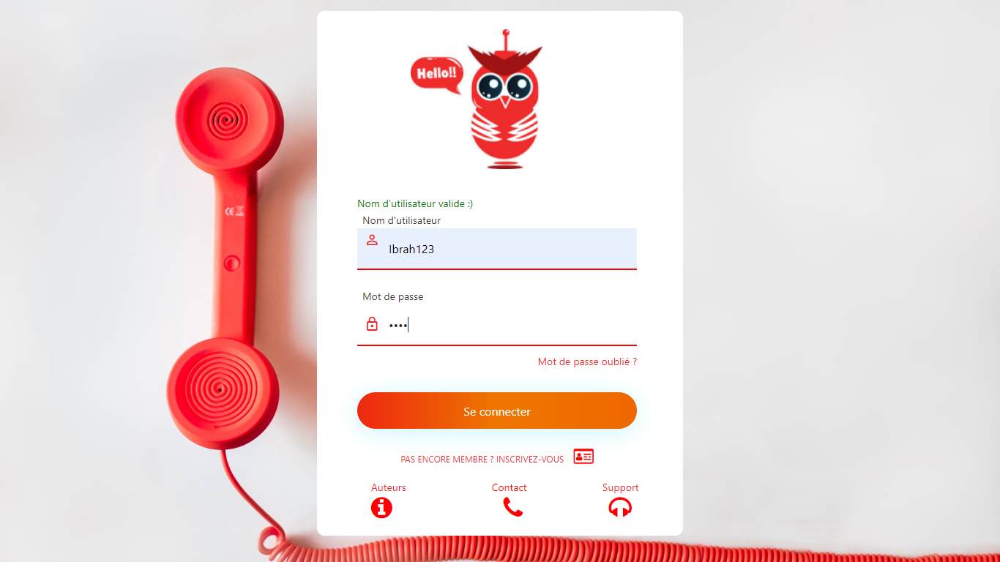
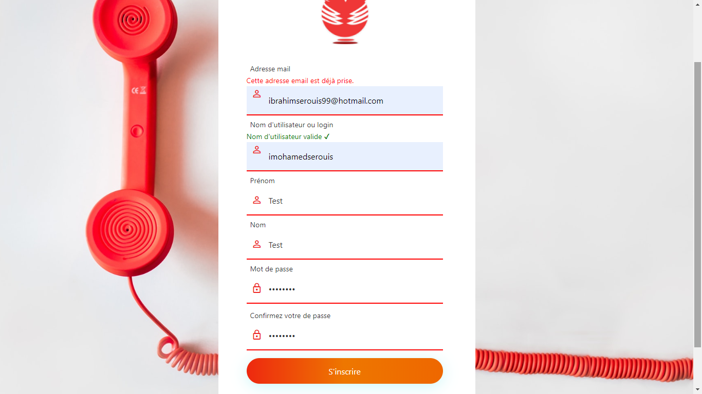
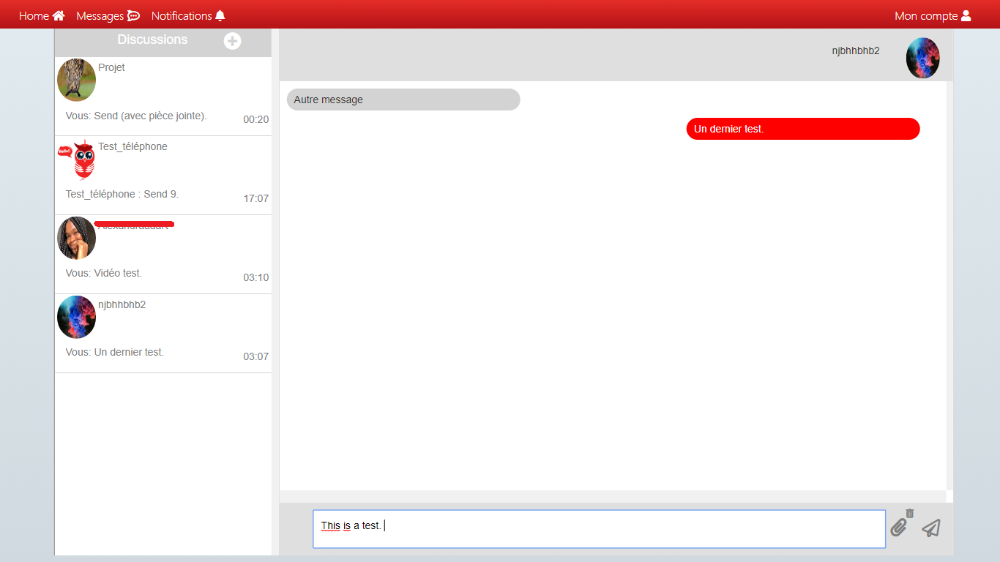

## Chat-app
This repository contains a chat-app Form App priorly designed for a school project. 

## Screenshots 

> **Discover the other features by downloading the software ! ** :blush:

## About the project
The software language is French. It is mainly made in pure web languages (HMTL, CSS, JavaScript)...though the links with the database is made with pure SQL queries & PHP. It was first in order to complete a school assignment, but I have deciced to upload it here to help some developpers not to do the exact same application,  for academic or project purposes by giving some patterns. Feel free to contribute, improve or criticize.

## Features
The project includes : 
- Text messsages as well as attachments. 
- Account creation.
- [x] Account modifications (not yet)

**Disclaimer : this project does not rely ont HTTPS, and there are some security flaws. Your contributions would be welcomed.**

## Pre-requisites & How to use :
To properly use it, you should first create a local MySQL schema which title will be "projet2"; unless you do not desire a database connection,but some features would be restricted. After installing, run the MySQL schema building script located [here](https://github.com/Justsecret123/Chat-app/blob/master/database.sql).

## Tools
- Languages : HTML5, CSS3, JavaScript/JQuery, PHP7, SQL; 
- Text editor : Brackets;
- Web server : Apache;
- Databse server : MySQL;
- Frameworks: Bootsrap, Font Awesome.
